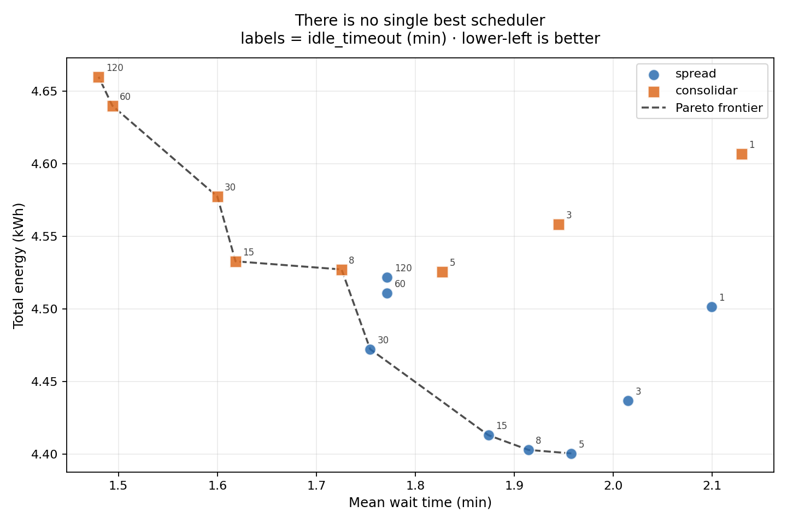

Note: This is a research project, not a product. Every conclusion below is valid *inside the simulation* and has not been validated against real hardware. See **Limitations**.

# ⚡ GPU Scheduling Energy

A data center simulator built to answer one question: **does packing AI workloads onto fewer GPUs actually save energy?**

Packing lets you power machines off and kill idle draw. But it also concentrates heat, and cooling a hotspot costs more than cooling several warm machines. This repo maps where the balance sits — and what happens once you add startup costs and variable demand.



*Every point is one scheduling policy at one idle timeout, averaged over 30 scenarios. Nine of sixteen sit on the frontier — spreading wins on energy, packing wins on wait time, and neither dominates. The seven points off the frontier are strictly worse on both axes.*

## 📊 Results at a glance

| # | Finding | Status |
|---|---|---|
| 1 | A thermal penalty threshold exists (~0.32) where the winning strategy flips | ⚠️ overturned by #2 |
| 2 | With realistic boot costs, that threshold collapses to ~0.0 — packing stops winning **on energy** | ⚠️ narrowed by #5 |
| 3 | Powering off too fast is expensive; the optimal idle timeout is a **zone** (5–15 min), not a value | ✅ holds |
| 4 | An adaptive scheduler beats spreading by **0.18%** under variable load — significant, irrelevant | ❌ negative result |
| 5 | Once latency is measured, spreading and packing are **not** better and worse — they are two ends of a Pareto trade-off | ⚠️ narrowed by #6 |
| 6 | Under saturation, the choice of scheduler stops mattering entirely — all three policies converge | ✅ holds |

### 🔍 The headline

> There is no single best scheduler. Spreading minimises energy; packing minimises wait time and tail latency. Nine of sixteen tested configurations sit on the Pareto frontier — none of them dominates the others, and choosing between them requires deciding what a minute of waiting is worth against a kWh. That is a business decision, not a technical one.

For most of this project spreading appeared to win outright. It won on the only axis being measured. Adding the second axis reframed the entire result — a reminder that a single-objective conclusion is only as honest as the objectives you left out.

**But that trade-off only exists while there is slack.** Pushing offered load from 60 to 300 tasks, all three policies converge: identical breaking point (150 tasks), identical wait times, identical energy to four decimal places. When every GPU is full there is no placement decision left to make. The scheduler matters in a narrow band — roughly 60–150 tasks here — and nowhere else.

**Secondary (negative) result:** adaptive switching between the two policies, driven by system load, is not a promising route to energy savings. The hypothesis held in direction but failed in magnitude — 0.18% improvement, present in only 56 of 100 scenarios.

### 🧪 How each claim was tested

| Technique | Purpose |
|---|---|
| Sensitivity analysis | Find which parameters each conclusion critically depends on |
| Common random numbers | Same scenarios across every configuration |
| Paired comparison | Cancel between-scenario variance — cut error 6× |
| Experimental control | Amplitude 0.0 baseline, to attribute cause |
| Pre-registered thresholds | Never pick the best parameter after seeing the data |
| Held-out seeds | Confirm on data never used during exploration |
| Pareto analysis | Compare on two objectives at once, instead of collapsing to one |

Finding #4 is why this matters: during exploration, two metrics appeared to win. Under confirmation with fresh seeds and frozen thresholds, one turned out to be a false positive from having tested 24 combinations.

---

## 🇬🇧 English

### About the project

AI workloads need GPUs. GPUs draw power and produce heat. Heat needs cooling, which draws more power. This simulator asks whether scheduling decisions — *which* GPU, *how many* powered on, *when* to shut one down — can meaningfully reduce that total.

The answer, so far, is mostly no. Which is the point: the project exists to find out, not to confirm.

### The model

**GPU** — a state machine: `off → booting → on → off`. Draws 0 W powered down, 400 W while booting (3 min, producing nothing), and `50 + 350 × load` W when active. Shuts itself down after `idle_timeout` minutes with no work.

**Cooling** — modelled as a surcharge on dissipated power:

```
P_cooling = P_gpu × (1 + hotspot_factor × load³)
```

The cubic exponent comes from fan affinity laws (fan power scales with the cube of airflow). **Caveat:** the model applies that exponent to GPU utilisation, not airflow. It's an analogy, not derived physics.

**Workloads** — arrive over time, each demanding 0.1–0.6 of a GPU for 10–40 minutes. Arrivals are either uniform or follow a wave with peaks and troughs.

**Schedulers** — all share the signature `(gpus, workload) -> GPU | None` and decide one task at a time with no knowledge of the future (*online* scheduling).

- `elegir_spread` — emptiest powered-on GPU with room
- `elegir_consolidar` — fullest powered-on GPU with room
- adaptive — packs or spreads depending on a system-state metric

### Limitations

1. **The cooling model is unvalidated.** The hotspot factor is invented, and the cubic exponent is applied to utilisation rather than airflow. The real chain (utilisation → power → temperature → RPM → fan power) has links the model skips.
2. **Boot costs are estimates.** 3 minutes at 400 W is plausible but unmeasured — and this parameter determines where finding #2's frontier falls.
3. **The Pareto trade-off only holds under slack.** Wait times differ by ~30 seconds across the entire frontier at 60 tasks. Raise offered load and the differences vanish: at 150+ tasks all policies are identical. So the trade-off is real but confined to a narrow load band, and its magnitude there is small.
4. **Throughput-normalised metrics mislead under saturation.** Energy per served task *falls* from 74 to 61 Wh as load triples — because total energy plateaus while served tasks keep rising. A system that drops 45% of its work looks maximally efficient. Any conclusion drawn above 150 tasks must be read alongside the completion rate.
5. **Small scale.** 5 GPUs, 60 tasks, 4 hours. Fragmentation and placement behave qualitatively differently at hundreds of nodes.
6. **No real traces.** Workloads are synthetic; duration and demand distributions come from nowhere in particular.
7. **Water consumption is not modelled**, despite being part of the original motivation. Water depends on cooling design and climate, not on the scheduler — software can only shift it in time and space.

### Running locally

No dependencies beyond `matplotlib` and `numpy`. Runs in Google Colab with nothing installed.

```bash
git clone https://github.com/GabriellyFerreiraa/gpu-scheduling-energy.git
cd gpu-scheduling-energy
```

Open the notebooks in Colab and run the cells in order. The first cell writes `simulador.py` via `%%writefile`; everything else imports it. Each experiment runs in seconds; the 100-seed confirmation takes a little longer.

---

## 🇪🇸 Español

### Sobre el proyecto

Las cargas de IA necesitan GPUs. Las GPUs consumen electricidad y generan calor. El calor requiere refrigeración, que consume más electricidad. Este simulador pregunta si las decisiones de scheduling — *qué* GPU, *cuántas* encendidas, *cuándo* apagar una — pueden reducir ese total de forma significativa.

La respuesta, hasta ahora, es mayormente no. Y ese es el punto: el proyecto existe para averiguarlo, no para confirmarlo.

### El modelo

**GPU** — una máquina de estados: `off → booting → on → off`. Consume 0 W apagada, 400 W durante el arranque (3 min, sin producir nada), y `50 + 350 × carga` W activa. Se apaga sola tras `idle_timeout` minutos sin trabajo.

**Refrigeración** — modelada como un recargo sobre la potencia disipada:

```
P_cooling = P_gpu × (1 + factor_hotspot × carga³)
```

El exponente cúbico viene de las leyes de afinidad de ventiladores (la potencia del ventilador escala con el cubo del caudal). **Advertencia:** el modelo aplica ese exponente a la utilización de la GPU, no al caudal. Es una analogía, no física derivada.

**Workloads** — llegan a lo largo del tiempo, cada uno demandando 0.1–0.6 de GPU durante 10–40 minutos. Las llegadas son uniformes o siguen una onda con picos y valles.

**Schedulers** — todos comparten la firma `(gpus, workload) -> GPU | None` y deciden una tarea por vez, sin conocer el futuro (scheduling *online*).

- `elegir_spread` — la GPU encendida más vacía con lugar
- `elegir_consolidar` — la GPU encendida más llena con lugar
- adaptativo — consolida o reparte según una métrica del estado del sistema

### Limitaciones

1. **El modelo de refrigeración no está validado.** El factor de hotspot es inventado, y el exponente cúbico se aplica a la utilización en lugar del caudal de aire. La cadena real (utilización → potencia → temperatura → RPM → potencia del ventilador) tiene eslabones que el modelo saltea.
2. **Los costos de encendido son estimados.** 3 minutos a 400 W es plausible pero no medido — y este parámetro determina dónde cae la frontera del hallazgo #2.
3. **El trade-off de Pareto solo se sostiene con holgura.** Las esperas difieren en ~30 segundos a lo largo de toda la frontera con 60 tareas. Al subir la carga las diferencias desaparecen: con 150+ tareas todas las políticas son idénticas. El trade-off es real pero está confinado a una banda estrecha de carga, y ahí su magnitud es chica.
4. **Las métricas normalizadas por throughput engañan bajo saturación.** La energía por tarea atendida *baja* de 74 a 61 Wh al triplicar la carga — porque la energía total se estanca mientras las tareas atendidas siguen subiendo. Un sistema que descarta el 45% del trabajo se ve máximamente eficiente. Toda conclusión por encima de 150 tareas debe leerse junto con la tasa de finalización.
5. **Escala pequeña.** 5 GPUs, 60 tareas, 4 horas. La fragmentación y las decisiones de colocación cambian cualitativamente a escala de cientos de nodos.
6. **Sin trazas reales.** Los workloads son sintéticos; las distribuciones de duración y demanda no provienen de mediciones.
7. **No se modela el consumo de agua**, pese a ser parte de la motivación original. El agua depende del diseño de refrigeración y del clima, no del scheduler — el software solo puede desplazarla en tiempo y espacio.

### Cómo ejecutar localmente

Sin dependencias más allá de `matplotlib` y `numpy`. Corre en Google Colab sin instalar nada.

```bash
git clone https://github.com/GabriellyFerreiraa/gpu-scheduling-energy.git
cd gpu-scheduling-energy
```

Abrí los notebooks en Colab y corré las celdas en orden. La primera celda escribe `simulador.py` mediante `%%writefile`; el resto lo importa. Cada experimento corre en segundos; la confirmación de 100 semillas tarda un poco más.

---

## 🇧🇷 Português

### Sobre o projeto

Cargas de IA precisam de GPUs. GPUs consomem energia e geram calor. O calor exige refrigeração, que consome mais energia. Este simulador pergunta se decisões de scheduling — *qual* GPU, *quantas* ligadas, *quando* desligar uma — podem reduzir esse total de forma significativa.

A resposta, até agora, é majoritariamente não. E esse é o ponto: o projeto existe pra descobrir, não pra confirmar.

### O modelo

**GPU** — uma máquina de estados: `off → booting → on → off`. Consome 0 W desligada, 400 W durante o boot (3 min, sem produzir nada), e `50 + 350 × carga` W ativa. Desliga sozinha após `idle_timeout` minutos sem trabalho.

**Refrigeração** — modelada como um acréscimo sobre a potência dissipada:

```
P_cooling = P_gpu × (1 + fator_hotspot × carga³)
```

O expoente cúbico vem das leis de afinidade de ventiladores (a potência do ventilador escala com o cubo da vazão). **Ressalva:** o modelo aplica esse expoente à utilização da GPU, não à vazão de ar. É uma analogia, não física derivada.

**Workloads** — chegam ao longo do tempo, cada um exigindo 0.1–0.6 de GPU por 10–40 minutos. As chegadas são uniformes ou seguem uma onda com picos e vales.

**Schedulers** — todos compartilham a assinatura `(gpus, workload) -> GPU | None` e decidem uma tarefa por vez, sem conhecer o futuro (scheduling *online*).

- `elegir_spread` — a GPU ligada mais vazia com espaço
- `elegir_consolidar` — a GPU ligada mais cheia com espaço
- adaptativo — concentra ou distribui conforme uma métrica do estado do sistema

### Limitações

1. **O modelo de refrigeração não é validado.** O fator de hotspot é inventado, e o expoente cúbico é aplicado à utilização em vez da vazão de ar. A cadeia real (utilização → potência → temperatura → RPM → potência do ventilador) tem elos que o modelo pula.
2. **Os custos de boot são estimados.** 3 minutos a 400 W é plausível mas não medido — e esse parâmetro determina onde cai a fronteira do achado #2.
3. **O trade-off de Pareto só vale com folga.** As esperas diferem em ~30 segundos ao longo de toda a fronteira com 60 tarefas. Ao aumentar a carga as diferenças somem: com 150+ tarefas todas as políticas são idênticas. O trade-off é real mas está confinado a uma faixa estreita de carga, e ali sua magnitude é pequena.
4. **Métricas normalizadas por throughput enganam sob saturação.** A energia por tarefa atendida *cai* de 74 para 61 Wh ao triplicar a carga — porque a energia total estagna enquanto as tarefas atendidas continuam subindo. Um sistema que descarta 45% do trabalho parece maximamente eficiente. Qualquer conclusão acima de 150 tarefas deve ser lida junto com a taxa de conclusão.
5. **Escala pequena.** 5 GPUs, 60 tarefas, 4 horas. Fragmentação e decisões de alocação mudam qualitativamente na escala de centenas de nós.
6. **Sem traces reais.** Os workloads são sintéticos; as distribuições de duração e demanda não vêm de medições.
7. **O consumo de água não é modelado**, apesar de fazer parte da motivação original. A água depende do projeto de refrigeração e do clima, não do scheduler — o software só pode deslocá-la no tempo e no espaço.

### Como rodar localmente

Sem dependências além de `matplotlib` e `numpy`. Roda no Google Colab sem instalar nada.

```bash
git clone https://github.com/GabriellyFerreiraa/gpu-scheduling-energy.git
cd gpu-scheduling-energy
```

Abra os notebooks no Colab e rode as células em ordem. A primeira célula escreve `simulador.py` via `%%writefile`; o resto importa. Cada experimento roda em segundos; a confirmação de 100 sementes demora um pouco mais.

---

## 📂 Project Structure

```
simulador.py                    # model: GPU, Workload, schedulers, simular()
01_umbral_hotspot.ipynb         # static model, sensitivity analysis
02_efecto_del_tiempo.ipynb      # time, thrashing, adaptive scheduler, confirmation
README.md
```

The model is defined once and imported by both notebooks, so a change to the physics doesn't require editing every experiment. Notebooks are numbered by **question**, not by topic — each one opens with a question and closes with an answer.

## 🔭 Next steps

- Sweep boot cost, now the critical parameter
- Sweep the 60–150 task band finely, to find where scheduling choice has maximum leverage
- Investigate fragmentation: spreading leaves capacity split across GPUs in unusable pieces, which is the likely cause of its worse tail latency
- Validate workload distributions against public cluster traces
- Investigate the observed mechanism by which variable load reduces packing's disadvantage (less thrashing during troughs)

## 👩‍💻 Author / Autora

**Gabrielly Ferreira** 📫 gabiferreira101@gmail.com 🔗 [LinkedIn](https://linkedin.com/in/gabrielly-ferreira-619609113) · [GitHub](https://github.com/GabriellyFerreiraa)

Built from scratch with no prior background in distributed systems or energy efficiency. The goal is as much to investigate the question as to learn to investigate rigorously — preferring well-measured negative results over badly-measured positive ones.

## 📄 License

MIT
